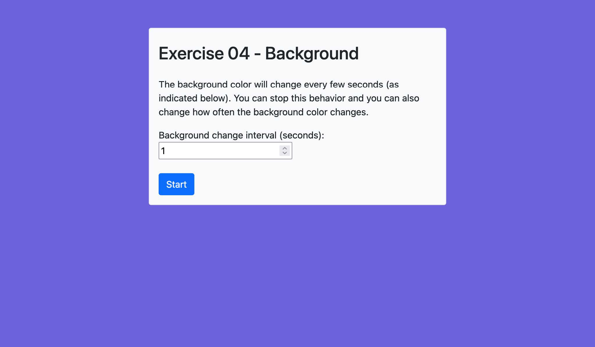

# HW 2 Instructions

Exercise 1: [Flexbox Froggy Game](https://flexboxfroggy.com/)

Exercise 2: [Grid Garden Game](https://cssgridgarden.com/)

## Exercise 03 | Word Highlight (Count)

Files:

1. [Count 03 HTML](./03-count.html)
2. [Count 03 JS](./03-count.js)

- Style the HTML file using Bootstrap 5 classes to match the screenshots below
- In the JavaScript file, write code to find and highlight all occurences of a particular word in the text given. The highlighted word should come from the user input.
  - Consider using string and array methods to complete this exercise.

Resources:

- [String | MDN](https://developer.mozilla.org/en-US/docs/Web/JavaScript/Reference/Global_Objects/String)
- [Array | MDN](https://developer.mozilla.org/en-US/docs/Web/JavaScript/Reference/Global_Objects/Array)
- [Keydown Event | MDN](https://developer.mozilla.org/en-US/docs/Web/API/Element/keydown_event)

## Exercise 04 | Background

Files:

1. [Background 04 HTML](./04-background.html)
2. [Background 04 JS](./04-background.js)

- Style the HTML file using Bootstrap 5 classes to match the screenshots below
- In the JavaScript file, you should set the background color to a randomly generated color for a given time interval (time interval input from user). Start by implementing a background color change every three seconds (default). You should implement a button that allows the user to 'stop' and 'start' the background color change. Once the background color change is stopped, the user should be able to specify a new interval for changing the background color (in seconds where, 1000 === 1 sec).
  - The solution should only implement one button; use different styles to toggle between 'start' and 'stop'.
  - Full colors tend to be harsh on the eyes. Instead of using full colors, generate rgba() or hsla() colors and dim the value of the alpha.

Resources:

- [Window Load Event | MDN](https://developer.mozilla.org/en-US/docs/Web/API/Window/load_event)
- [Input type='number' | MDN](https://developer.mozilla.org/en-US/docs/Web/HTML/Element/input/number)
- [Math.random() | MDN](https://developer.mozilla.org/en-US/docs/Web/JavaScript/Reference/Global_Objects/Math/random)
- [setInterval() | MDN](https://developer.mozilla.org/en-US/docs/Web/API/setInterval)

## Exercise 05 | Form Input

Files:

1. [Background 05 HTML](./05-form.html)
2. [Background 05 JS](./05-form.js)

- Style the HTML file using Bootstrap 5 classes to match the screenshots below
- In the JavaScript file, write code to grab all user input and print it to the console.
  - The form should be empty when it loads, meaning there should be no default value on any item.
  - Use the submit event on the form submission.
  - Make sure your implementation works on various browsers.
- Personal Note: use the <select> [box] </select> allowing more than one selection value

Resources:

- [Forms | Bootstrap 5](https://getbootstrap.com/docs/5.0/forms/overview/)
- [HTTP and Forms | Eloquent JavaScript](https://eloquentjavascript.net/18_http.html)
- [Submit event | MDN](https://developer.mozilla.org/en-US/docs/Web/API/HTMLFormElement/submit_event)

## Code Quality Expectation

- Check that all JavaScript code follows the style guides in the
  - [AirBnB JS Docs](https://github.com/airbnb/javascript)
- Make sure the solution is responsive by using the Device Toolbar or Design View in DevTools Browser
- Ensure the solution is accessible by using the Wave and/or AIM extension in the browser
- Ensure code is properly formatted and consistent throughout all exercises. Use Prettier to automatically format your code.
- Make sure to delete unnecessary code from the submission
- Cite any outside sources used to come up with the solution

## Submission

- Due Date: Week 4 by Wednesday @ 5pm
- Submit the URL to the pull request in the discussion: Code Review for HW 2 as part of the initial post
- Add all discussion groups members as reviewers
- You will need to review all submissions as part of the discussion follow up post on Friday
